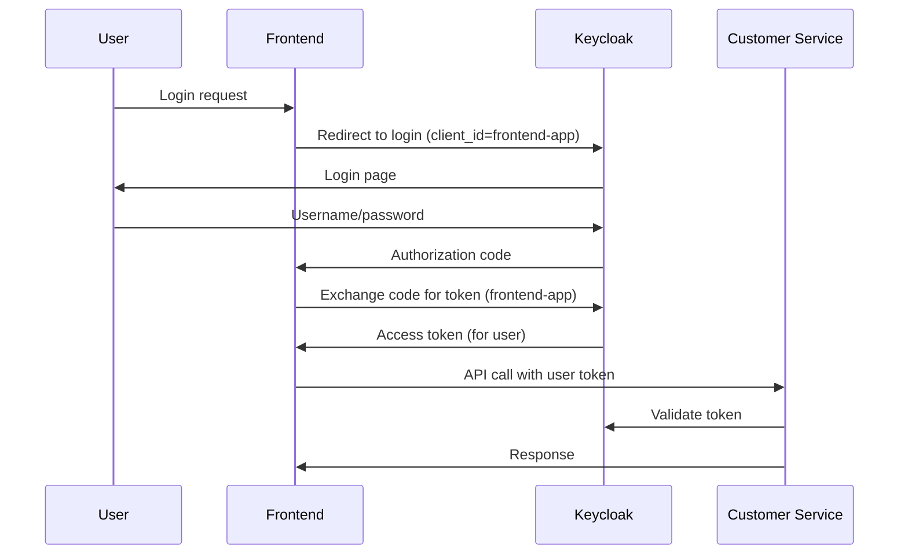
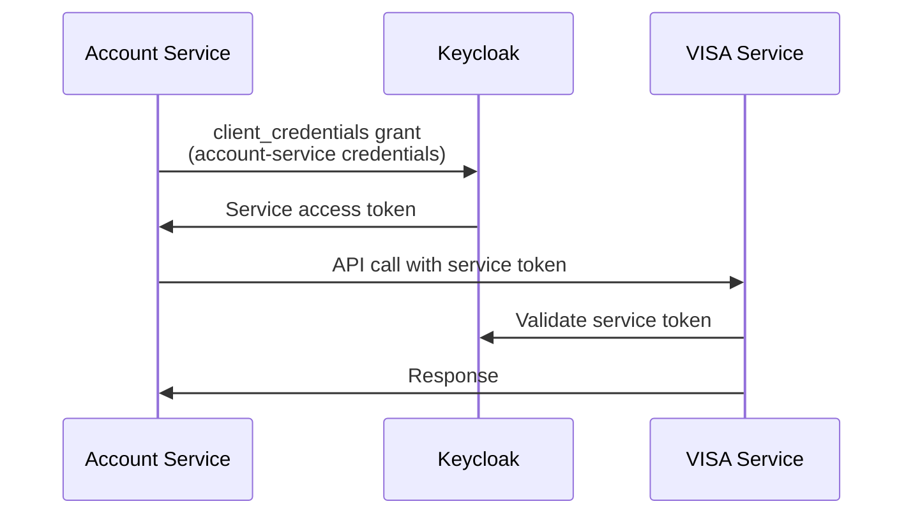

# Kiến trúc Keycloak cho Microservices Banking System

## 1. Realm Structure

```
Realm: myrealm
├── Users (All customers stored here)
│   ├── customer1@email.com
│   ├── customer2@email.com
│   └── ...
├── Clients (Applications/Services)
│   ├── frontend-app (Public Client)
│   ├── customer-service (Confidential Client)
│   ├── account-service (Confidential Client)
│   ├── visa-service (Confidential Client)
│   └── master-service (Confidential Client)
└── Roles
    ├── CUSTOMER
    ├── ADMIN
    └── SERVICE_ACCOUNT
```

## 2. Client Types & Purposes

### A. **frontend-app** (Public Client)
- **Type**: Public (SPA/Mobile app)
- **Purpose**: User login interface
- **Grant Types**: Authorization Code + PKCE
- **Users**: Customers login through this client
```javascript
// Frontend login
const loginUrl = `${keycloakUrl}/realms/myrealm/protocol/openid-connect/auth
  ?client_id=frontend-app
  &redirect_uri=http://localhost:3000/callback
  &response_type=code
  &scope=openid`;
```

### B. **customer-service** (Confidential Client)
- **Type**: Confidential
- **Purpose**: Handle user management operations
- **Grant Types**: 
  - `client_credentials` (for admin operations)
  - Accept tokens from frontend-app
```yaml
# customer-service application.yaml
keycloak:
  client-id: customer-service
  client-secret: customer-service-secret-123
```

### C. **account-service** (Confidential Client)
- **Type**: Confidential  
- **Purpose**: Handle account operations + inter-service calls
- **Grant Types**:
  - `client_credentials` (for calling other services)
  - Accept tokens from frontend-app
```yaml
# account-service application.yaml  
keycloak:
  client-id: account-service
  client-secret: account-service-secret-456
```

### D. **visa-service** & **master-service** (Confidential Clients)
- **Type**: Confidential
- **Purpose**: Card registration services
- **Grant Types**: Accept tokens from account-service
```yaml
# visa-service application.yaml
keycloak:
  client-id: visa-service
  client-secret: visa-service-secret-789
```

## 3. Authentication Flows

### Flow 1: User Login (Frontend → Customer Service)


### Flow 2: Service-to-Service (Account → VISA)


## 4. Token Examples

### User Token (từ frontend login)
```json
{
  "sub": "customer-uuid-123",
  "preferred_username": "customer1@email.com",
  "realm_access": {
    "roles": ["CUSTOMER"]
  },
  "azp": "frontend-app",    // ← Client ID where user logged in
  "aud": ["customer-service", "account-service"]
}
```

### Service Token (từ client_credentials)
```json
{
  "sub": "service-account-account-service",
  "realm_access": {
    "roles": ["SERVICE_ACCOUNT"]  
  },
  "azp": "account-service",      // ← Service client ID
  "aud": ["visa-service", "master-service"]
}
```

## 5. Security Boundaries

### Client Isolation
- Mỗi service có client riêng → Security isolation
- Nếu một service bị compromise, không ảnh hưởng đến services khác
- Có thể revoke/rotate secrets độc lập

### Audience Control
```yaml
# visa-service chỉ accept tokens từ account-service
spring:
  security:
    oauth2:
      resourceserver:
        jwt:
          audiences: account-service
```

## 6. Best Practices

### ✅ DO
- Mỗi service có client riêng
- Sử dụng client_credentials cho service-to-service
- Users login through frontend client
- Configure proper audiences

### ❌ DON'T  
- Dùng chung client cho nhiều services
- Hardcode client secrets
- Use resource owner password grant
- Skip audience validation

## 7. Configuration Summary

| Component | Client ID | Client Type | Purpose |
|-----------|-----------|-------------|---------|
| Frontend | frontend-app | Public | User login |
| Customer Service | customer-service | Confidential | User management + Accept user tokens |
| Account Service | account-service | Confidential | Account ops + Service calls |
| VISA Service | visa-service | Confidential | Accept service tokens |
| Master Service | master-service | Confidential | Accept service tokens |

## 8. FAQ

**Q: Tại sao không dùng chung 1 client?**
A: Security isolation, easier credential management, fine-grained access control

**Q: User data lưu ở đâu?**
A: Users lưu ở realm level, có thể login qua bất kỳ client nào được configure

**Q: Service gọi service khác như thế nào?**
A: Service A dùng client_credentials để lấy token, gọi Service B với token đó 